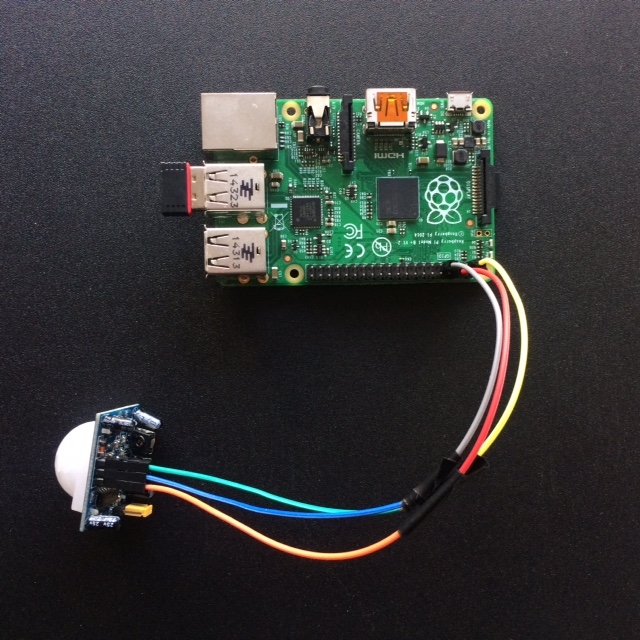
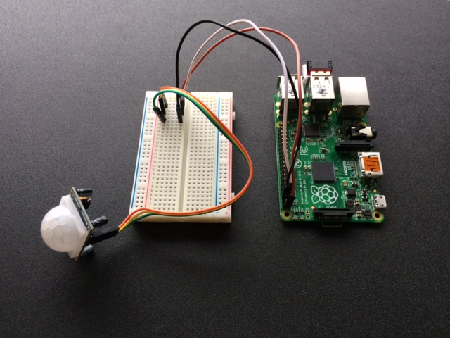
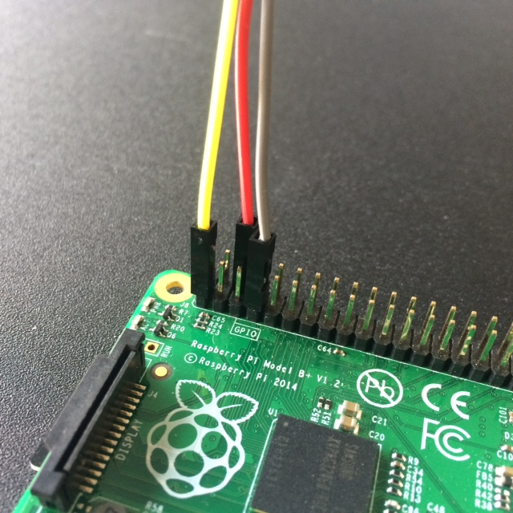
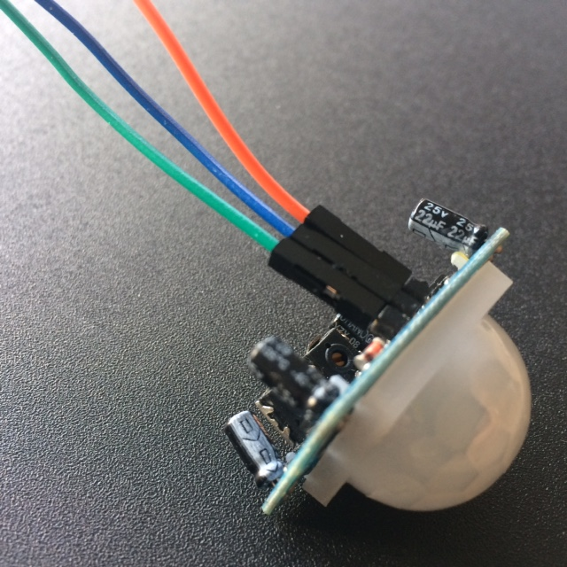
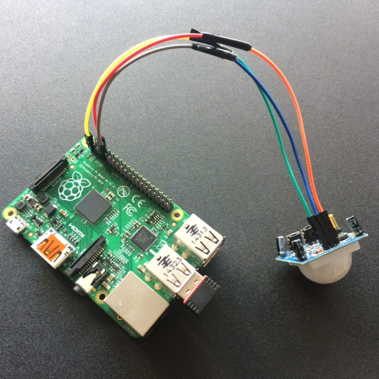

# Sensor Butler
   

> _A Raspberry Pi device to share a message on a slack channel when a door is opened._

  

**1) Slack & Webhooks**    
Create a slack team for prototyping purposes and your first slack App. You will need a incoming webhook url to send the POST request with your message to slack.

**_~ Resources ~_**    
https://api.slack.com/tutorials/slack-apps-hello-world  

Try out your incoming webhook in the terminal:
```
curl -X POST -H 'Content-type: application/json' --data '{"text":"Door :door: is open! :open_hands:"}' https://hooks.slack.com/services/YOUR-SLACK-WEBHOOK
```
**2) Raspberry Pi and PIR (passive infrared) motion sensor**  

Build your Raspberry Pi device. You will need:
* Raspberry Pi
* PIR sensor  
* USB Wi-Fi adaptor
* Jumper wires (female to female)   
_Note: male to female will work too if you have a Breadboard_



> **_IMPORTANT: Setup_**   
You will need access to the RPi via screen (HDMI), mouse and keyboard.

 | 
------------ | -------------
 | 

**_~ Resources ~_**    
https://www.hackster.io/hardikrathod/pir-motion-sensor-with-raspberry-pi-415c04
https://www.raspberrypi.org/learning/parent-detector/worksheet/

**3) Download the sensor-butler repository in your RPi**  

In the Terminal:
```
$ cd Desktop
$ git clone https://github.com/nenoch/sensor-butler.git
```
Open ```pir.py``` and change the webhook url to the one in your slack app.

**_~ Resources ~_**    
https://projects.raspberrypi.org/en/projects/getting-started-with-git

**4) Schedule tasks with Cron**  
Follow the instruction in the cron-config.md file.
With this setting the sensor will be active at reboot and then everyday after midnight. Remember that the sensor will be 'triggerable' only once per day.   
_Note: remember change the path if your directory is not in the Desktop_

**_~ Resources ~_**    
https://www.raspberrypi.org/documentation/linux/usage/cron.md
